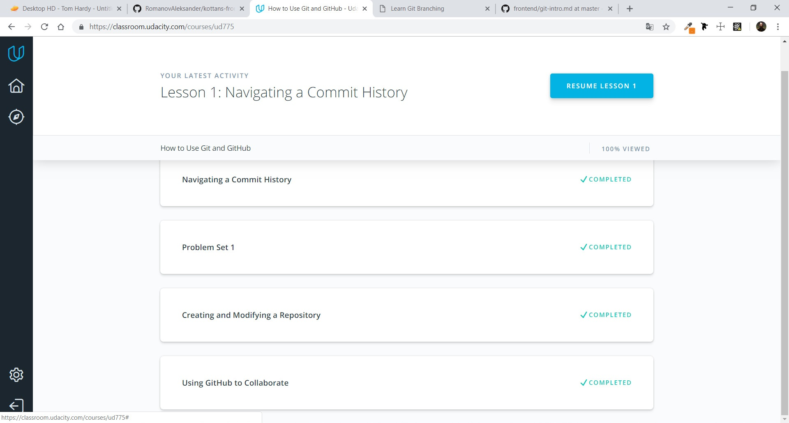

# Kottans-Frontend
<<<<<<< HEAD
## Git and GitHub

I finished the course How to use Git and GitHub. It was very interestung. 
I learned a lot of new git commands, made pull request and create repo.
## Linux CLI, and HTTP

It was new for me. I didn't think that via the command line we can do so many 
manipulations.
 I will use all the knowledge that I gained in this course in the future.
=======
# Git and GitHub

>>>>>>> bb06c3dd8dec35cc24879b789bd7bd5fc15ba9be
