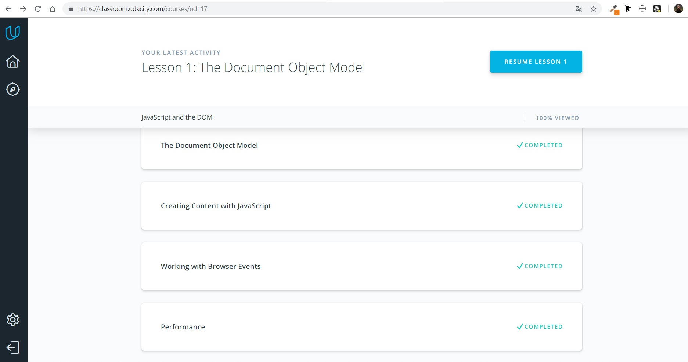

# Kottans-Frontend
## Git and GitHub

I finished the course How to use Git and GitHub. It was very interestung. 
I learned a lot of new git commands, made pull request and create repo.

## Linux CLI, and HTTP

It was new for me. I didn't think that via the command line we can do so many 
manipulations.
 I will use all the knowledge that I gained in this course in the future.
 
## Git Collaboration

## Intro to HTML and CSS

I knew HTML and CSS, so for me this course was not difficult. 
I resumed my knowledge and I was glad to study the basics again.

## Responsive Web Design

It was a very interesting course, I learned a lot. For example:
* I understood why it is so important to use responsive web design
* how to optimize images, tables, and fonts to make for the best responsive layouts
* learned the most important tools in developing any responsive web application: media queries and [flexbox](http://flexboxfroggy.com/)
 * and most importantly: I realized that this is art, not science
 
 ## JS Basics
 
 
 
 It was interesting and complicated, I repeated/learned learned the basics of JS: 
 * data types & variables
 * loops
 * functions
 * arrays
 * objects
 * conditionals
 
 I finished first half of the course [freecodecamp Algorithm Scripting Challenges](https://learn.freecodecamp.org/javascript-algorithms-and-data-structures/intermediate-algorithm-scripting)
 (It was very difficult. Honestly speaking, I used hints and read a lot of documentation)
 
 ## DOM

 
 