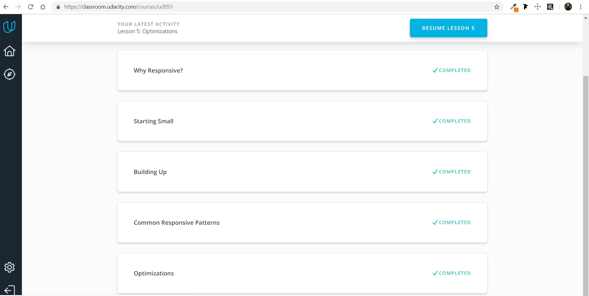
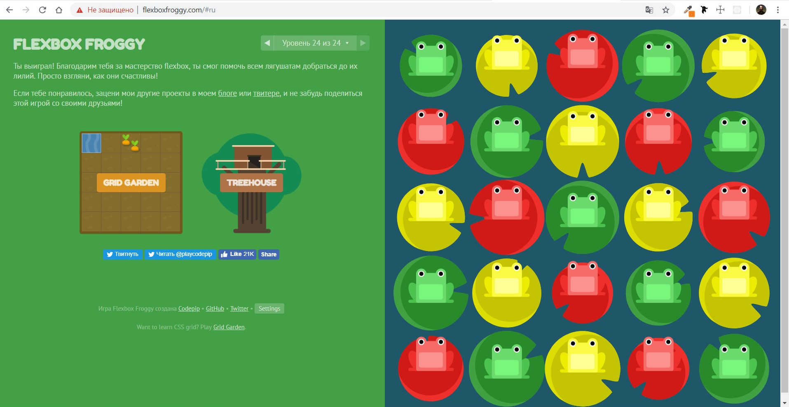

## Responsive Web Design 

It was a very interesting course, I learned a lot. For example:
* I understood why it is so important to use responsive web design
* how to optimize images, tables, and fonts to make for the best responsive layouts
* learned the most important tools in developing any responsive web application: media queries and [flexbox](http://flexboxfroggy.com/)
* and most importantly: I realized that this is art, not science
 